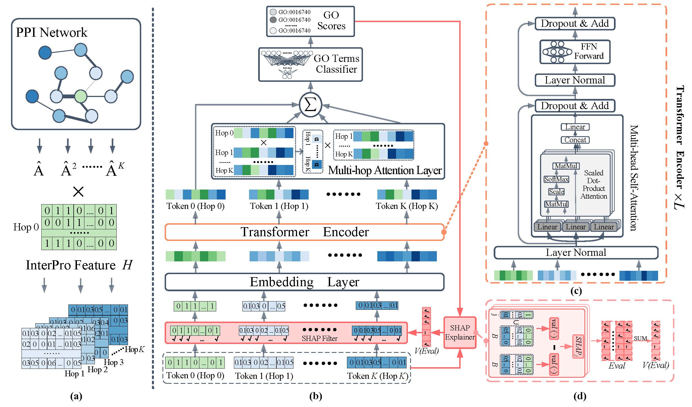

# SEGT-GO

This repo contains the data and key codes of the paper "SEGT-GO: A Graph Transformer Method Based on PPI Serialization and Explanatory Artificial Intelligence for Protein Function Prediction."

## A Gentle Introduction



The schematic of SEGT-GO. (a) The PPI multi-hop neighborhood serialization encoding module. The normalized multi-hop adjacency matrix from the PPI Network is multiplied by the InterPro Feature $H$ to obtain the serialized PPI multi-hop neighborhood feature tokens. (b) SEGT-GO architecture diagram. The serialized PPI multi-hop neighborhood tokens are filtered by the SHAP Filter and fed into the Embedding Layer for feature mapping. The Transformer Encoder captures potential functional relationships between PPI multi-hop neighborhoods. The Multi-hop Attention Layer aggregates neighborhood information based on the importance of different hops relative to Hop 0. The GO Terms Classifier predicts protein functions using the aggregated information. The SHAP Explainer analyzes the predictions and provides an evaluation vector $V(Eval)$. (c) Detailed structure of the Transformer Encoder. $L$ determines the number of layers in the Transformer Encoder. (d) SHAP Explainer workflow. The SHAP Explainer uses the value function $val(\cdot)$ to assess the impact of various features on protein function prediction. The final feature evaluation values ($Eval$) are summed to produce the feature filter's importance evaluation vector $V(Eval)$.

## Dataset

### deepGraphGO_data

./deepGraphGO_data is the data from [DeepGraphGO](https://github.com/yourh/DeepGraphGO). It is composed as follows:

- pid_list.txt: each protein name a line
- go.txt: each pair of protein name and GO a line
- ppi_mat.npz: adjacency matrix in scipy.sparse.csr_matrix
- ppi_interpro.npz: the intepro binary feature of each protein in ppi_pid_list.txt
- ppi_blastdb: the blastdb of ppi.fasta

For more details, please refer to [DeepGraphGO](https://github.com/yourh/DeepGraphGO) and Section 2.1 “Data Preparation” of the SEGT-GO paper.

## cfago_data

./cfago_data is the data from [CFAGO](https://academic.oup.com/bioinformatics/article-pdf/39/3/btad123/49598190/btad123.pdf). It is composed as follows:

- human_annot.mat: the protein annotation dictionary
- human_location_feature.zip: the subcellular location and domain binary features of each protein in CFAGO human dataset
- human_net_combined.zip: the unnormalized ppi raw network
- human_proteins.txt: each protein name

For more details, please refer to [CFAGO](https://academic.oup.com/bioinformatics/article-pdf/39/3/btad123/49598190/btad123.pdf) and SEGT-GO Supplemental Material-Part B “Basic Information of Dataset B”.

## Acknowledge

Our code is built upon [DeepGraphGO](https://github.com/yourh/DeepGraphGO) and [NAGphormer](https://github.com/JHL-HUST/NAGphormer), we thank the authors for their open-sourced code.

## License

This repository is released under the Apache 2.0 license.

## Contact

If you have any questions, please feel free to contact me at [yansongwang_hit@stu.hit.edu.cn](mailto:yansongwang_hit@stu.hit.edu.cn)

## Cite

If you find this code useful, please consider citing the original work by the authors:
```
@article{wang2025segt,
  title={SEGT-GO: a graph transformer method based on PPI serialization and explanatory artificial intelligence for protein function prediction},
  author={Wang, Yansong and Sun, Yundong and Lin, Baohui and Zhang, Haotian and Luo, Xiaoling and Liu, Yumeng and Jin, Xiaopeng and Zhu, Dongjie},
  journal={BMC bioinformatics},
  volume={26},
  number={1},
  pages={46},
  year={2025},
  publisher={Springer}
}
```
